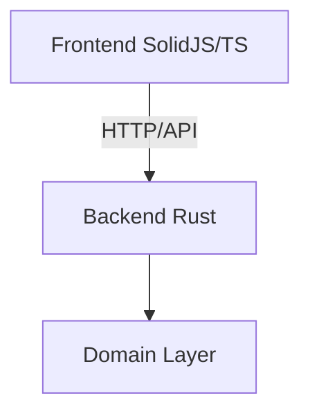
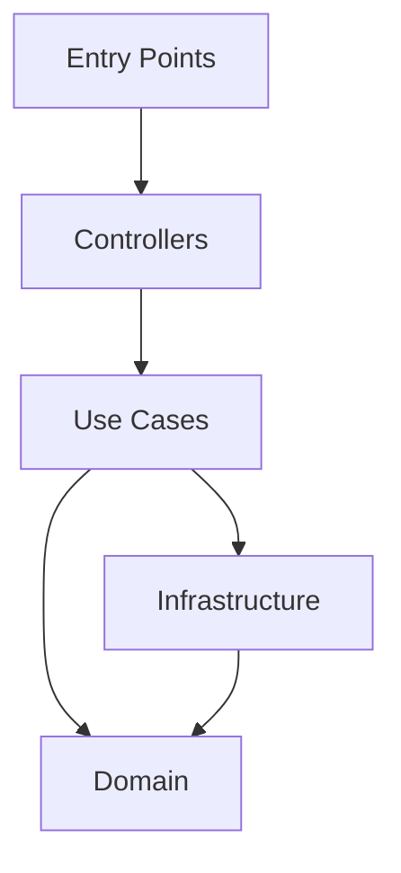
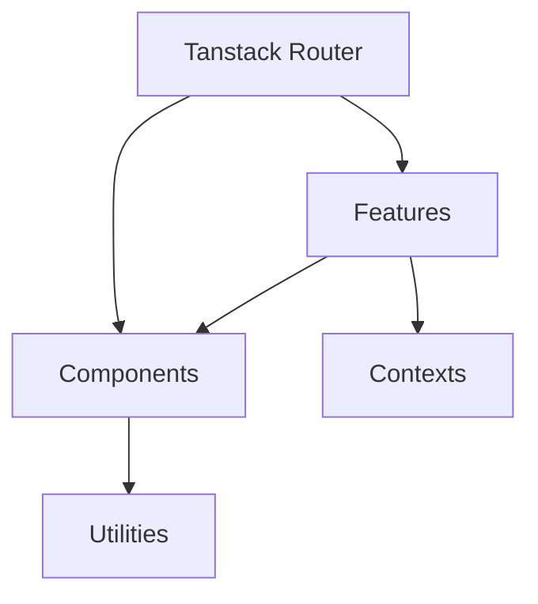
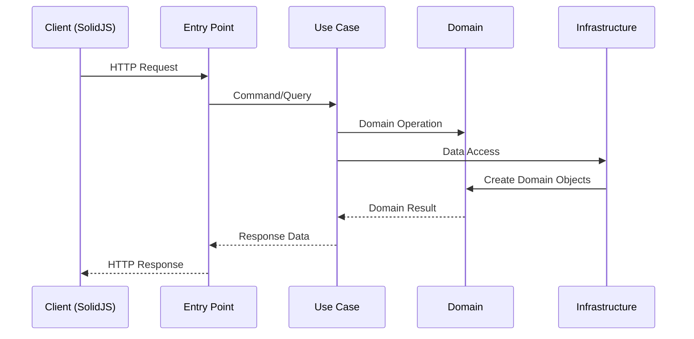

# Architecture Overview

This document outlines the architectural design of the system, explaining key patterns, decisions, and the overall structure.

## System Architecture

The system follows a client-server architecture with:

- A Rust backend implementing domain-driven design (DDD)
- A SolidJS frontend using a feature-based organization with Tanstack Router

## Backend Architecture

The backend follows a layered architecture based on DDD principles:

### Layers

1. **Domain Layer** (`crates/domain/`)

   - Core business logic and rules
   - Entities, value objects, and domain services
   - Repository interfaces
   - Pure Rust implementation without external dependencies

2. **Application Layer** (`crates/backend/src/use_case/`)

   - Orchestrates domain objects to perform specific use cases
   - Implements business workflows
   - Coordinates between infrastructure and domain layers

3. **Infrastructure Layer** (`crates/backend/src/infrastructure/`)

   - Implements repository interfaces
   - Handles data persistence
   - Manages external service integrations

4. **Interface Layer** (`crates/interface/`, `crates/interface-traits/`)

   - Defines external API contracts
   - Handles request/response mapping
   - Manages API versioning

5. **Entry Points** (`crates/backend/src/entry_point/`)
   - HTTP/API endpoints
   - Request handling and routing
   - Authentication and authorization

### Key Patterns

1. **Repository Pattern**

   - Abstracts data persistence
   - Defined in domain layer
   - Implemented in infrastructure layer

2. **Value Objects**

   - Encapsulate domain concepts
   - Immutable by design
   - Self-validating

3. **Entity Pattern**
   - Represents domain objects with identity
   - Encapsulates business rules
   - Maintains invariants

## Frontend Architecture

The frontend follows a feature-based architecture with SolidJS and Tanstack Router:

### Organization

1. **Routes** (`frontend/src/routes/`)

   - Page components using Tanstack Router
   - Declarative routing with type-safe paths
   - Data loading and mutations

2. **Features** (`frontend/src/features/`)

   - Feature-specific business logic
   - State management with SolidJS signals
   - API integration

3. **Components** (`frontend/src/components/`)

   - Reusable UI components
   - Reactive rendering with SolidJS
   - Component-specific styling

4. **Contexts** (`frontend/src/contexts/`)

   - Global state management with SolidJS context
   - Shared functionality
   - Cross-cutting concerns

5. **Utils** (`frontend/src/utils/`)
   - Shared utilities
   - Helper functions
   - Type definitions

### Key Patterns

1. **Feature-based Organization**

   - Features are self-contained
   - Clear boundaries between features
   - Reusable across routes

2. **Reactive State Management**

   - Fine-grained reactivity with signals
   - Computed values
   - Effects for side effects

3. **Type-safe Routing**
   - Route type definitions
   - Loader and action type safety
   - Path parameter validation

## Data Flow

## Error Handling

1. **Backend**

   - Domain errors for business rule violations
   - Application errors for use case failures
   - Infrastructure errors for technical issues

2. **Frontend**
   - Result type for API responses
   - Global error handling via context
   - User-friendly error messages

## Security

1. **Authentication**

   - Entry point guards
   - Principal-based identity
   - Session management

2. **Authorization**
   - Role-based access control
   - Resource ownership validation
   - Permission checking in use cases
